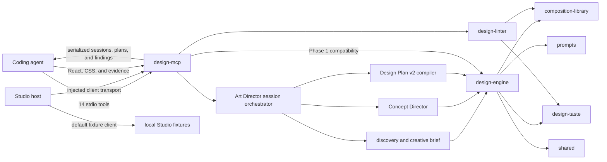

# Architecture and Ownership

Terminology used by the contracts and flows below is defined in the
[Universal glossary](GLOSSARY.md).

Universal is a local-first pnpm monorepo for turning explicit discovery decisions into an approved
Design Plan v2, a validated React project, and an isolated production preview. This guide describes
code that exists on `main`; roadmap milestones are not presented as shipped behavior.

## Current system boundary

Universal has three implemented local paths: the Phase 1 compatibility planning/review path, the
Phase 2 Art Director path, and the Phase 3 generated-project path. Phase 2 adds deterministic
discovery, explicit creative-brief approval, concept development, direction selection, and Design
Plan v2 compilation. Phase 3 binds that approved plan to provider-neutral generation, a trusted
loopback runtime, a fixed React/Vite template, a production build, and an isolated preview.



`design-mcp` is a transport adapter. It validates MCP inputs, delegates planning to
`design-engine`, delegates review to `design-linter`, and serializes results. Its Phase 2 Art
Director orchestrator owns session phase transitions, request idempotency, and bindings between
approved briefs and downstream artifacts; discovery policy, concept selection, and plan contracts
remain in `design-engine`.

Studio implements discovery, brief review, direction selection, Design Plan v2 presentation, and
generation/build lifecycle UI. Its deterministic local Art Director and runtime adapters remain
available for isolated UI development. A host can inject MCP and runtime-backed adapters; the
browser application never connects to stdio MCP, writes project files, installs dependencies,
spawns processes, or receives provider credentials.

Preview queries validated runtime records and accepts only a loopback descriptor bound to the
selected project's latest successful build and revision. It loads that descriptor in a scripts-only
sandboxed iframe, retains the last successful build when a newer attempt fails, and never accepts an
arbitrary URL.

## Workspace responsibilities

| Workspace                      | Owns                                                                                                                                             | Boundary or current status                                                                  |
| ------------------------------ | ------------------------------------------------------------------------------------------------------------------------------------------------ | ------------------------------------------------------------------------------------------- |
| `apps/studio`                  | Discovery, approvals, direction/plan presentation, and generation/build lifecycle UI plus deterministic and injected adapters.                   | Browser-only and unprivileged; runtime records remain authoritative.                        |
| `apps/preview`                 | Runtime-derived preview states and scripts-only iframe for a bound successful build.                                                             | Rejects arbitrary or stale descriptors and has no filesystem/process authority.             |
| `examples/demo-site`           | Standalone React/Vite example for the MCP-guided workflow.                                                                                       | Not a reusable package or runtime template.                                                 |
| `packages/design-engine`       | Canonical Phase 1 and Phase 2 contracts, discovery policy, creative briefs, concept selection, plan compilation, validation, and downstream API. | Provider and transport concerns stay outside the engine.                                    |
| `packages/design-mcp`          | Stdio server, 14 tool schemas, MCP envelopes, and serialized Art Director session orchestration.                                                 | Owns transport/session state transitions, not domain policy or privileged runtime behavior. |
| `packages/generation`          | Digest-bound generation contracts, provider port, schema/quota/secret validation, and deterministic React provider.                              | Does not write files, install packages, or control runtime configuration.                   |
| `packages/runtime-contracts`   | JSON-safe project, revision, operation, build, review, preview, event records and validators.                                                    | No storage, networking, process, or UI implementation.                                      |
| `packages/local-runtime`       | Session boundary, provider configuration, records, workspaces, locked builds, deterministic review, preview, and recovery.                       | Trusted loopback process; does not invent creative policy or provide hosting.               |
| `packages/prompts`             | Versioned provider-neutral definitions, interpolation, rendering, serialization, and fixtures.                                                   | No provider-specific chat formatting or transport.                                          |
| `packages/composition-library` | Hero/navigation catalogs, contracts, signatures, validation, diversity scoring, and selection primitives.                                        | No React rendering or MCP handling.                                                         |
| `packages/design-linter`       | Deterministic source/evidence review, structural-signature extraction, and actionable findings.                                                  | Does not inspect screenshot pixels or mutate source.                                        |
| `packages/design-taste`        | Versioned principles, contextual anti-patterns, decision rationale, and exception policy.                                                        | Policy, not a visual preset or UI layer.                                                    |
| `packages/design-benchmark`    | Offline benchmark schemas, fixtures, runners, checks, scoring, and reports.                                                                      | Evaluation tooling, not part of an MCP request.                                             |
| `packages/shared`              | Small stable cross-package domain types and `Result` utilities.                                                                                  | Not a catch-all for code without a clear owner.                                             |
| `packages/ui`                  | Small shared React primitives for Universal applications.                                                                                        | No engine policy or application state.                                                      |

## Phase 3 generated-project flow

```mermaid
flowchart LR
  U[User] --> ST[Studio]
  ST -->|approved brief and direction| DP[Design Plan v2]
  DP -->|digest-bound request| RT[trusted local runtime]
  RT --> G[provider-neutral React generator]
  G -->|validated source manifest| WS[immutable workspace revision]
  WS -->|frozen offline install| B[production build]
  B --> RV[deterministic implementation review]
  RV --> PS[separate loopback preview origin]
  PS --> PV[Preview sandboxed iframe]
  RT -->|projects, operations, builds, events| ST
  RT -->|bound preview descriptor| PV
```



The fixed generated-project template is `packages/local-runtime/template`; it is not
`examples/demo-site` and cannot be authored by a provider. Model output is limited to validated
source files/assets. It cannot choose dependencies, scripts, Vite/TypeScript configuration, preview
policy, shell commands, or filesystem destinations.

The runtime persists and validates project, revision, operation, build, review, preview, and event
records. Mutations require an idempotency key. A restart marks active records interrupted.
Cancellation and timeout terminate the process tree. A new build becomes visible only after
generation, materialization, locked install, production build, and deterministic review succeed. A
failed newer attempt leaves the prior ready build active.

## Current request flows

### Phase 2 Art Director session

1. A client calls `start_art_direction`; the MCP layer starts a versioned serialized session and
   deterministic discovery session.
2. `get_discovery_questions` reads the next adaptive question group.
   `submit_discovery_answers` records answers, interpretations, and the page map.
3. `get_creative_brief` prepares a reviewable brief only after required high-impact information is
   present. It does not infer approval.
4. `approve_creative_brief` binds explicit approval to the current brief digest.
5. `develop_art_direction` invokes the Concept Director service, which generates and evaluates
   differentiated candidates from the approved brief.
6. `get_selected_direction` binds the recommended candidate to the approved-brief and concept
   digests.
7. `create_design_plan_v2` invokes the compiler service and binds the validated plan to the current
   approved brief and selected direction.

Every response contains the complete serialized session for the next call. Stable `requestId`
values make mutation retries idempotent and reject conflicting reuse. `revise_creative_brief`
revokes approval and marks affected concepts, directions, and plans stale; stale artifacts cannot
cross later phase boundaries. `get_art_direction_session` validates session shape and digest
bindings without advancing it.

### Generate and build MCP-host-authored React

1. A client completes the Phase 2 flow through `create_design_plan_v2`.
2. `prepare_react_generation` validates the exact plan-created session and exposes the canonical
   `GenerationContext`, source allowlist, quotas, required files, runtime-owned-file denylist, and a proportional architecture policy derived from routes, sections, and shared elements.
3. The MCP host model authors React, TypeScript, CSS, text, and optional approved image assets. It
   cannot author dependencies, scripts, commands, entrypoints, build configuration, or paths
   outside `src/`.
4. `build_react_project` derives a project binding from Design Plan v2 and an immutable revision
   identity from the sorted source plus a stable request ID.
5. The submitted-source provider passes the files through `ReactGenerator` validation and secret
   scanning, then `RuntimeService` performs safe materialization, offline frozen installation,
   production build, and deterministic implementation review including TypeScript-AST architecture analysis.
6. A successful MCP result returns the immutable workspace and production output paths. The caller
   may run the runtime-owned `pnpm run dev` script, which binds Vite to `127.0.0.1`.

Architecture review is part of the trusted runtime rather than a separate caller-invoked lint command. Multi-route plans require identifiable external page modules and route coverage; substantial single pages require meaningful section/feature composition; small pages remain compact. Stable `ARCH_*` findings include structured evidence for App JSX complexity, page and route mappings, shared modules, props typing, duplicated subtrees, inline data, and stylesheet distribution. Blocking errors prevent readiness, while advisory warnings remain in build diagnostics. Passing establishes a minimum repository architecture but does not replace human code review.
This is not a live-provider adapter: the already-authorized MCP host model is the source author. The
submitted files remain untrusted at the generation and runtime boundaries. The MCP layer owns only
transport adaptation and serialization; `generation` and `local-runtime` remain the validation and
execution owners.

### Create a Phase 1 compatibility plan

1. A coding agent calls `create_design_plan` with a prompt and optional constraints.
2. `design-mcp` validates the transport input with Zod.
3. Its adapter passes the brief and recent composition history to the canonical orchestrator in
   `design-engine`.
4. The engine selects and validates composition data, applies `design-taste`, and uses
   provider-neutral prompt definitions where needed.
5. The engine returns a `DesignPlan`; `design-mcp` serializes it into MCP text content.

`create_design_plan` remains the lower-level compatibility API: it does not start discovery, require
approval, develop concepts, or produce Design Plan v2. `get_design_rules` and `get_taste_profile`
are read-only views over engine rules and the active taste profile. The domain packages remain the
policy owners.

### Review an implementation

1. A coding agent calls `review_implementation` with React/CSS source and, when available, desktop
   and mobile screenshot evidence plus expected composition context.
2. `design-mcp` validates the request and calls `design-linter`.
3. `design-linter` checks source signals, evidence completeness, composition consistency, and
   `design-taste` rules.
4. The tool returns a score, status, actionable findings, passed principles, and unresolved decisions.

Screenshot records prove that a client performed visual checks; the current linter does not read or
analyze image files.

## Dependency direction

Dependencies point from applications and transport toward domain owners:

```text
apps/studio --------------------> design-engine, generation/browser, runtime-contracts, ui
apps/preview -------------------> runtime-contracts
local-runtime ------------------> generation, runtime-contracts
generation ---------------------> design-engine
runtime-contracts --------------> no internal workspace package

design-mcp ---------------------> design-engine and design-policy packages
      `-------------------------> generation/local-runtime only in golden-test dev dependencies

design-engine ------------------> composition-library, design-linter, design-taste, prompts, shared
design-benchmark ---------------> no runtime authority
```

`apps/studio` defines transport-shaped adapters but does not import MCP or runtime implementation.
A host supplies those implementations. Runtime contracts have no dependency on runtime
implementation. Browser-safe generation request construction is exported separately from
Node/provider behavior. `packages/ui` has React peer dependencies but no domain-package dependency.
Avoid reversing these arrows: domain packages must not import MCP, Studio, Preview, or local runtime.

## Implemented and planned boundaries

Implemented now:

- Deterministic design planning and canonical plan validation.
- Deterministic adaptive discovery, decision provenance, creative-brief revision, and explicit
  digest-bound approval.
- Concept Director contracts, provider injection, offline provider, evaluation, and recommended
  direction selection.
- Strict Design Plan v2 provider-draft validation, provenance checks, compilation, digests, and
  parsing.
- Serialized Phase 2 Art Director sessions with legal transitions, idempotent mutation retries,
  stale-artifact invalidation, and artifact-binding validation.
- Composition catalogs, contracts, signatures, and selection primitives.
- Versioned prompt assembly and taste policy.
- Deterministic implementation review.
- Four Phase 1 compatibility/policy MCP tools and ten Phase 2 Art Director tools.
- A multi-stage Studio UI with deterministic and injectable MCP/runtime adapters.
- Provider-neutral, digest-bound React generation with a nontrivial offline default provider.
- A trusted loopback runtime with validated immutable workspaces, frozen installs, process-tree
  supervision, structured recovery, and separate-origin static preview serving.
- A Preview application that validates runtime-issued descriptors and preserves last-known-good.
- Offline design-quality benchmark tooling with explicit desktop/mobile rendered evidence and
  independent negative detection for every Phase 3 dimension.

Deferred boundaries:

- Hosted backend, deployment, public preview URLs, and multi-user authentication.
- Arbitrary provider-authored dependencies, scripts, configuration, or shell commands.
- A production live-provider adapter; trusted runtime injection is the implemented boundary.
- OS/container sandboxing and a complete Windows/macOS/Linux end-to-end matrix.
- Autonomous multi-step section regeneration, visual variants, and collaborative editing. Phase 3.2
  supports one bounded, attributable rendered-QA child revision through a trusted adapter.
- Runtime-hosted UI assets, WebSockets, and automatic retention beyond safe abandoned-work cleanup.

See [Phase 3 local runtime](PHASE3_RUNTIME.md),
[ADR 0001](adr/0001-local-runtime-architecture.md),
[ADR 0002](adr/0002-phase3-runtime-protocol-narrowing.md),
[ADR 0003](adr/0003-phase3-quality-acceptance-assets.md), and
[Downstream API](DOWNSTREAM_API.md).

## Choosing the owning workspace

Choose the narrowest package that can express and test the behavior:

- Change a brief-to-plan rule, contract, or orchestration behavior in `design-engine`.
- Change discovery policy, creative-brief behavior, concept evaluation, or Design Plan v2 compilation
  in `design-engine`.
- Change MCP names, input validation, serialized Art Director session transitions, idempotency, or
  result transport in `design-mcp`.
- Change prompt wording, variables, versions, or fixtures in `prompts`.
- Change catalogs, composition contracts, signatures, or diversity scoring in
  `composition-library`.
- Change review detection or finding construction in `design-linter`.
- Change a principle, contextual anti-pattern, or rationale policy in `design-taste`.
- Change evaluation fixtures, rendered-evidence contracts, checks, scores, or reports in
  `design-benchmark`.
- Change generation request/output contracts, provider validation, or deterministic source in
  `generation`.
- Change runtime records exchanged with browser clients in `runtime-contracts`.
- Change filesystem, process, provider-credential, HTTP-session, build, or preview authority in
  `local-runtime`.
- Add a shared type only when at least two domain owners genuinely exchange it.
- Change Studio stages, answer editing, plan presentation, generation lifecycle, or client
  adaptation in `apps/studio`; change Preview presentation in `apps/preview`; promote only a
  broadly reusable primitive to `ui`.

If a change spans transport and domain behavior, implement behavior in its domain owner and keep MCP
changes to validation and delegation. If a feature requires runtime, filesystem, network, process, or
credential authority, treat it as runtime architecture work instead of adding those privileges to a
UI or MCP package.

Rendered QA records route- and viewport-specific screenshot digests and findings, keeping
machine-verifiable observations separate from human visual judgment. Child revisions are bounded
and linked to immutable parents. Acceptance and export are explicit runtime operations outside
generation; export destinations must remain beneath configured roots and retain Design Plan, review,
revision, acceptance, and timestamp provenance. Assets are local, manifest-driven, media-validated,
and never grant the model authority over dependencies, downloads, build configuration, or commands.
