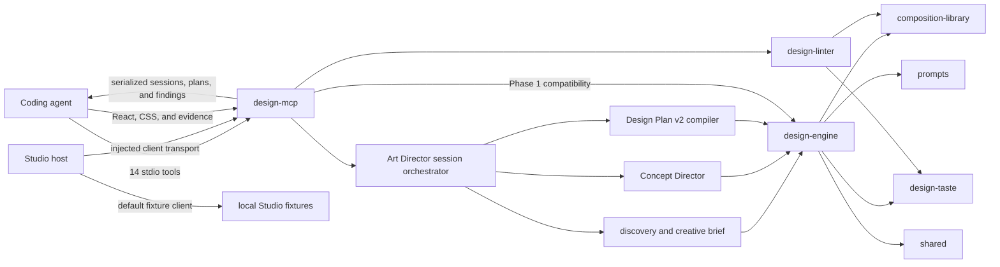

# Architecture and Ownership

Universal is a pnpm monorepo for turning a design brief into a structured, art-directed React
implementation workflow. This guide describes code that exists on `main`; roadmap milestones are not
presented as shipped behavior.

## Current system boundary

Universal currently has two implemented local paths: the Phase 1 compatibility planning/review
path and the Phase 2 Art Director path. Phase 2 adds deterministic discovery, an explicitly
approved creative brief, concept development, direction selection, and Design Plan v2 compilation.



`design-mcp` is a transport adapter. It validates MCP inputs, delegates planning to
`design-engine`, delegates review to `design-linter`, and serializes results. Its Phase 2 Art
Director orchestrator owns session phase transitions, request idempotency, and bindings between
approved briefs and downstream artifacts; discovery policy, concept selection, and plan contracts
remain in `design-engine`.

Studio implements the discovery, brief-review, direction, and plan presentation stages. Its default
`createLocalArtDirectorClient()` is an in-browser fixture/demo client. A host can instead inject an
`ArtDirectorClient`, including one built with `createMcpArtDirectorClient()` and an
`ArtDirectorMcpTransport`. The browser application does not connect directly to stdio MCP. Preview
still renders a static empty state and does not start projects or load generated URLs. Local runtime,
generated-project materialization, build supervision, live reload, and revision loops remain
architectural work.

## Workspace responsibilities

| Workspace                      | Owns                                                                                                                                             | Boundary or current status                                                                  |
| ------------------------------ | ------------------------------------------------------------------------------------------------------------------------------------------------ | ------------------------------------------------------------------------------------------- |
| `apps/studio`                  | Phase 2 discovery, brief approval, direction review, and Design Plan v2 presentation UI plus injectable client adapters.                         | Defaults to local fixture data; does not generate code or manage runtime lifecycle.         |
| `apps/preview`                 | React shell intended to present preview lifecycle UI.                                                                                            | Currently a static empty state; it does not load or supervise generated apps.               |
| `examples/demo-site`           | Standalone React/Vite example for the MCP-guided workflow.                                                                                       | Not a reusable package or runtime template.                                                 |
| `packages/design-engine`       | Canonical Phase 1 and Phase 2 contracts, discovery policy, creative briefs, concept selection, plan compilation, validation, and downstream API. | Provider and transport concerns stay outside the engine.                                    |
| `packages/design-mcp`          | Stdio server, 14 tool schemas, MCP envelopes, and serialized Art Director session orchestration.                                                 | Owns transport/session state transitions, not domain policy or privileged runtime behavior. |
| `packages/prompts`             | Versioned provider-neutral definitions, interpolation, rendering, serialization, and fixtures.                                                   | No provider-specific chat formatting or transport.                                          |
| `packages/composition-library` | Hero/navigation catalogs, contracts, signatures, validation, diversity scoring, and selection primitives.                                        | No React rendering or MCP handling.                                                         |
| `packages/design-linter`       | Deterministic source/evidence review, structural-signature extraction, and actionable findings.                                                  | Does not inspect screenshot pixels or mutate source.                                        |
| `packages/design-taste`        | Versioned principles, contextual anti-patterns, decision rationale, and exception policy.                                                        | Policy, not a visual preset or UI layer.                                                    |
| `packages/design-benchmark`    | Offline benchmark schemas, fixtures, runners, checks, scoring, and reports.                                                                      | Evaluation tooling, not part of an MCP request.                                             |
| `packages/shared`              | Small stable cross-package domain types and `Result` utilities.                                                                                  | Not a catch-all for code without a clear owner.                                             |
| `packages/ui`                  | Small shared React primitives for Universal applications.                                                                                        | No engine policy or application state.                                                      |

## Current request flows

### Phase 2 Art Director session

1. A client calls `start_art_direction`; the MCP layer starts a versioned serialized session and
   deterministic discovery session.
2. `get_discovery_questions` reads the next adaptive question group.
   `submit_discovery_answers` records answers, interpretations, and the page map.
3. `get_creative_brief` prepares a reviewable brief only after required high-impact information is
   present. It does not infer approval.
4. `approve_creative_brief` binds explicit approval to the current brief digest.
5. `develop_art_direction` invokes the Concept Director service, which generates and evaluates
   differentiated candidates from the approved brief.
6. `get_selected_direction` binds the recommended candidate to the approved-brief and concept
   digests.
7. `create_design_plan_v2` invokes the compiler service and binds the validated plan to the current
   approved brief and selected direction.

Every response contains the complete serialized session for the next call. Stable `requestId`
values make mutation retries idempotent and reject conflicting reuse. `revise_creative_brief`
revokes approval and marks affected concepts, directions, and plans stale; stale artifacts cannot
cross later phase boundaries. `get_art_direction_session` validates session shape and digest
bindings without advancing it.

### Create a Phase 1 compatibility plan

1. A coding agent calls `create_design_plan` with a prompt and optional constraints.
2. `design-mcp` validates the transport input with Zod.
3. Its adapter passes the brief and recent composition history to the canonical orchestrator in
   `design-engine`.
4. The engine selects and validates composition data, applies `design-taste`, and uses
   provider-neutral prompt definitions where needed.
5. The engine returns a `DesignPlan`; `design-mcp` serializes it into MCP text content.

`create_design_plan` remains the lower-level compatibility API: it does not start discovery, require
approval, develop concepts, or produce Design Plan v2. `get_design_rules` and `get_taste_profile`
are read-only views over engine rules and the active taste profile. The domain packages remain the
policy owners.

### Review an implementation

1. A coding agent calls `review_implementation` with React/CSS source and, when available, desktop
   and mobile screenshot evidence plus expected composition context.
2. `design-mcp` validates the request and calls `design-linter`.
3. `design-linter` checks source signals, evidence completeness, composition consistency, and
   `design-taste` rules.
4. The tool returns a score, status, actionable findings, passed principles, and unresolved decisions.

Screenshot records prove that a client performed visual checks; the current linter does not read or
analyze image files.

## Dependency direction

Dependencies point from applications and transport toward domain owners:

```text
apps/studio --------------------> design-engine
      `-------------------------> ui

design-mcp ---------------------> design-engine
      |-------------------------> design-linter
      |-------------------------> composition-library
      |-------------------------> design-taste
      |-------------------------> prompts
      `-------------------------> shared

design-engine ------------------> composition-library ---> shared
      |-------------------------> design-linter ----------> design-taste
      |-------------------------> design-taste
      |-------------------------> prompts
      `-------------------------> shared

apps/preview, examples/demo-site, design-benchmark,
design-taste, prompts, shared     (no internal workspace dependencies)
```

`apps/studio` also defines a transport-shaped client adapter, but it does not import MCP package
internals. A host supplies the transport implementation. `packages/ui` has React peer dependencies
but no domain-package dependency. Avoid reversing these arrows: domain packages should not import
MCP, Studio, or Preview.

## Implemented and planned boundaries

Implemented now:

- Deterministic design planning and canonical plan validation.
- Deterministic adaptive discovery, decision provenance, creative-brief revision, and explicit
  digest-bound approval.
- Concept Director contracts, provider injection, offline provider, evaluation, and recommended
  direction selection.
- Strict Design Plan v2 provider-draft validation, provenance checks, compilation, digests, and
  parsing.
- Serialized Phase 2 Art Director sessions with legal transitions, idempotent mutation retries,
  stale-artifact invalidation, and artifact-binding validation.
- Composition catalogs, contracts, signatures, and selection primitives.
- Versioned prompt assembly and taste policy.
- Deterministic implementation review.
- Four Phase 1 compatibility/policy MCP tools and ten Phase 2 Art Director tools.
- A multi-stage Studio UI with a local fixture client and injectable MCP transport adapter.
- Static Preview and demo React applications.
- Offline design-quality benchmark tooling.

Architectural placeholders or future work:

- A trusted local runtime for generation, filesystem writes, builds, and preview serving.
- Model-provider adapters and credential handling.
- Wiring the browser Studio to a host-provided MCP transport in the shipped application.
- Studio-to-runtime project generation after direction selection.
- Generated-project materialization and process supervision.
- Preview URL loading, iframe isolation, reload recovery, and lifecycle errors.
- Automated section revision and regeneration.

For the proposed runtime boundary and threat model, see
[ADR 0001: Local Runtime Architecture](adr/0001-local-runtime-architecture.md). For code using current
engine behavior, see [Downstream API](DOWNSTREAM_API.md).

## Choosing the owning workspace

Choose the narrowest package that can express and test the behavior:

- Change a brief-to-plan rule, contract, or orchestration behavior in `design-engine`.
- Change discovery policy, creative-brief behavior, concept evaluation, or Design Plan v2 compilation
  in `design-engine`.
- Change MCP names, input validation, serialized Art Director session transitions, idempotency, or
  result transport in `design-mcp`.
- Change prompt wording, variables, versions, or fixtures in `prompts`.
- Change catalogs, composition contracts, signatures, or diversity scoring in
  `composition-library`.
- Change review detection or finding construction in `design-linter`.
- Change a principle, contextual anti-pattern, or rationale policy in `design-taste`.
- Change evaluation fixtures, checks, scores, or reports in `design-benchmark`.
- Add a shared type only when at least two domain owners genuinely exchange it.
- Change Studio stages, answer editing, plan presentation, or client adaptation in `apps/studio`;
  change Preview presentation in `apps/preview`; promote only a broadly reusable primitive to `ui`.

If a change spans transport and domain behavior, implement behavior in its domain owner and keep MCP
changes to validation and delegation. If a feature requires runtime, filesystem, network, process, or
credential authority, treat it as runtime architecture work instead of adding those privileges to a
UI or MCP package.
