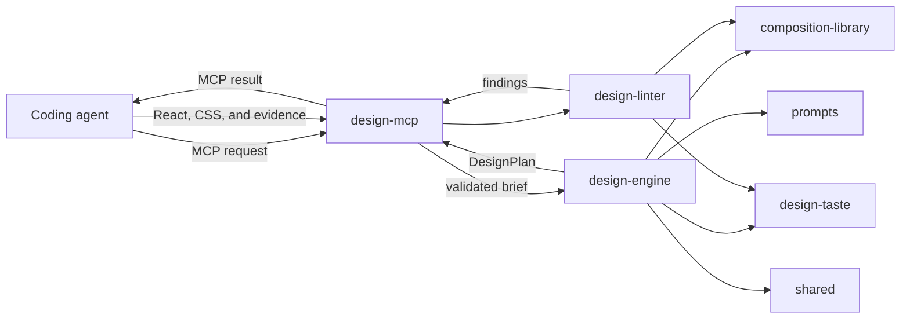

# Architecture and Ownership

Universal is a pnpm monorepo for turning a design brief into a structured, art-directed React
implementation workflow. This guide describes code that exists on `main`; roadmap milestones are not
presented as shipped behavior.

## Current system boundary

The implemented end-to-end path is local MCP planning and review:



`design-mcp` is a transport adapter. It validates MCP inputs, delegates planning to
`design-engine`, delegates review to `design-linter`, and serializes results. It does not own design
planning, prompt policy, composition selection, or review rules.

Studio and Preview are application shells. Studio renders a brief-oriented interface and imports
engine types and shared UI, but generation is not connected to a runtime. Preview renders a static
empty state; it does not start projects or load generated URLs. The local runtime, generated-project
materialization, build supervision, live reload, and revision loop described by the roadmap and ADR
are architectural work, not current behavior.

## Workspace responsibilities

| Workspace                      | Owns                                                                                                              | Boundary or current status                                                    |
| ------------------------------ | ----------------------------------------------------------------------------------------------------------------- | ----------------------------------------------------------------------------- |
| `apps/studio`                  | React shell for collecting and presenting design-direction input.                                                 | Does not currently invoke generation or manage runtime lifecycle.             |
| `apps/preview`                 | React shell intended to present preview lifecycle UI.                                                             | Currently a static empty state; it does not load or supervise generated apps. |
| `examples/demo-site`           | Standalone React/Vite example for the MCP-guided workflow.                                                        | Not a reusable package or runtime template.                                   |
| `packages/design-engine`       | Canonical contracts, validation, deterministic planning, discovery, orchestration interfaces, and downstream API. | Provider and transport concerns stay outside the engine.                      |
| `packages/design-mcp`          | Stdio server, Zod transport schemas, MCP envelopes, and thin engine/linter adapters.                              | No domain policy or privileged runtime behavior.                              |
| `packages/prompts`             | Versioned provider-neutral definitions, interpolation, rendering, serialization, and fixtures.                    | No provider-specific chat formatting or transport.                            |
| `packages/composition-library` | Hero/navigation catalogs, contracts, signatures, validation, diversity scoring, and selection primitives.         | No React rendering or MCP handling.                                           |
| `packages/design-linter`       | Deterministic source/evidence review, structural-signature extraction, and actionable findings.                   | Does not inspect screenshot pixels or mutate source.                          |
| `packages/design-taste`        | Versioned principles, contextual anti-patterns, decision rationale, and exception policy.                         | Policy, not a visual preset or UI layer.                                      |
| `packages/design-benchmark`    | Offline benchmark schemas, fixtures, runners, checks, scoring, and reports.                                       | Evaluation tooling, not part of an MCP request.                               |
| `packages/shared`              | Small stable cross-package domain types and `Result` utilities.                                                   | Not a catch-all for code without a clear owner.                               |
| `packages/ui`                  | Small shared React primitives for Universal applications.                                                         | No engine policy or application state.                                        |

## Current request flows

### Create a design plan

1. A coding agent calls `create_design_plan` with a prompt and optional constraints.
2. `design-mcp` validates the transport input with Zod.
3. Its adapter passes the brief and recent composition history to the canonical orchestrator in
   `design-engine`.
4. The engine selects and validates composition data, applies `design-taste`, and uses
   provider-neutral prompt definitions where needed.
5. The engine returns a `DesignPlan`; `design-mcp` serializes it into MCP text content.

`get_design_rules` and `get_taste_profile` are read-only views over engine rules and the active taste
profile. The domain packages remain the policy owners.

### Review an implementation

1. A coding agent calls `review_implementation` with React/CSS source and, when available, desktop
   and mobile screenshot evidence plus expected composition context.
2. `design-mcp` validates the request and calls `design-linter`.
3. `design-linter` checks source signals, evidence completeness, composition consistency, and
   `design-taste` rules.
4. The tool returns a score, status, actionable findings, passed principles, and unresolved decisions.

Screenshot records prove that a client performed visual checks; the current linter does not read or
analyze image files.

## Dependency direction

Dependencies point from applications and transport toward domain owners:

```text
apps/studio --------------------> design-engine
      `-------------------------> ui

design-mcp ---------------------> design-engine
      |-------------------------> design-linter
      |-------------------------> composition-library
      |-------------------------> design-taste
      |-------------------------> prompts
      `-------------------------> shared

design-engine ------------------> composition-library ---> shared
      |-------------------------> design-linter ----------> design-taste
      |-------------------------> design-taste
      |-------------------------> prompts
      `-------------------------> shared

apps/preview, examples/demo-site, design-benchmark,
design-taste, prompts, shared     (no internal workspace dependencies)
```

`packages/ui` has React peer dependencies but no domain-package dependency. Avoid reversing these
arrows: domain packages should not import MCP, Studio, or Preview.

## Implemented and planned boundaries

Implemented now:

- Deterministic design planning and canonical plan validation.
- Composition catalogs, contracts, signatures, and selection primitives.
- Versioned prompt assembly and taste policy.
- Deterministic implementation review.
- Four MCP tools: planning, rules, taste profile, and implementation review.
- Static Studio, Preview, and demo React applications.
- Offline design-quality benchmark tooling.

Architectural placeholders or future work:

- A trusted local runtime for generation, filesystem writes, builds, and preview serving.
- Model-provider adapters and credential handling.
- Studio-to-runtime generation and direction selection.
- Generated-project materialization and process supervision.
- Preview URL loading, iframe isolation, reload recovery, and lifecycle errors.
- Automated section revision and regeneration.

For the proposed runtime boundary and threat model, see
[ADR 0001: Local Runtime Architecture](adr/0001-local-runtime-architecture.md). For code using current
engine behavior, see [Downstream API](DOWNSTREAM_API.md).

## Choosing the owning workspace

Choose the narrowest package that can express and test the behavior:

- Change a brief-to-plan rule, contract, or orchestration behavior in `design-engine`.
- Change MCP names, input validation, or result transport in `design-mcp`.
- Change prompt wording, variables, versions, or fixtures in `prompts`.
- Change catalogs, composition contracts, signatures, or diversity scoring in
  `composition-library`.
- Change review detection or finding construction in `design-linter`.
- Change a principle, contextual anti-pattern, or rationale policy in `design-taste`.
- Change evaluation fixtures, checks, scores, or reports in `design-benchmark`.
- Add a shared type only when at least two domain owners genuinely exchange it.
- Change app interaction and presentation in its owning app; promote only a broadly reusable
  primitive to `ui`.

If a change spans transport and domain behavior, implement behavior in its domain owner and keep MCP
changes to validation and delegation. If a feature requires runtime, filesystem, network, process, or
credential authority, treat it as runtime architecture work instead of adding those privileges to a
UI or MCP package.
