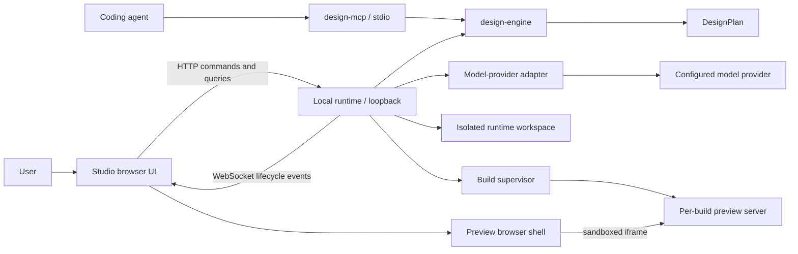
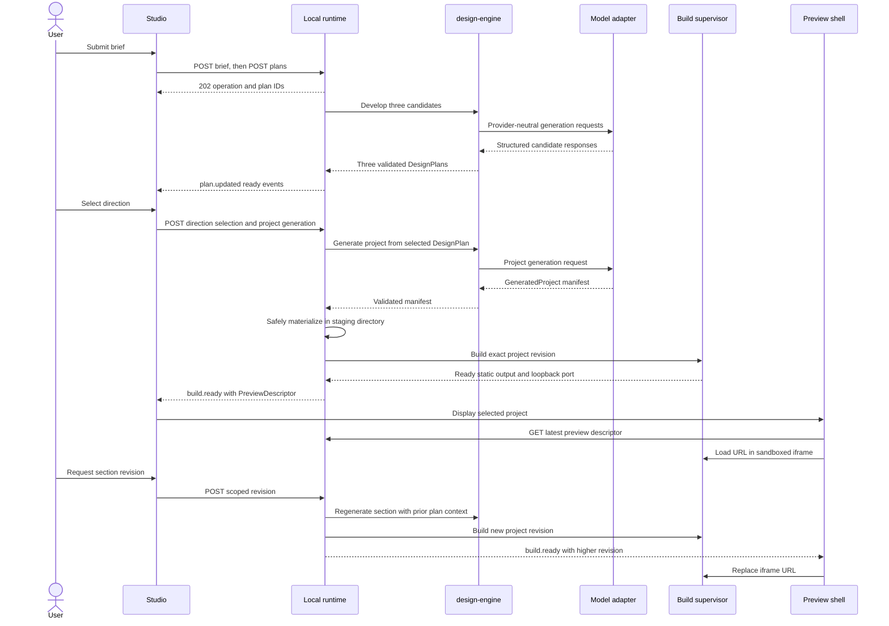

# ADR 0001: Local runtime architecture

- Status: Accepted for MVP implementation
- Date: 2026-07-15
- Decision owners: Universal maintainers
- Scope: Local orchestration, generation, build, and preview boundaries

## Context

Universal promises a local-first Studio that turns a design brief into three art-directed React
directions, materializes a selected direction, builds it, and displays an isolated live preview.
The current repository has the planning and review contracts, a deterministic MCP adapter, and
Studio and Preview shells. It does not yet have the trusted process needed to call model providers,
write files, run builds, or manage preview processes.

The roadmap also says "No backend." A browser cannot safely perform those operations itself: it
cannot protect provider credentials, write an arbitrary project tree, or supervise child processes.
For this decision, "no backend" means **no hosted or persistent remote Universal service**. The MVP
does require a trusted, local runtime process on the user's machine. That process is part of the
local application, stores state only on the local filesystem, and is not reachable from the LAN.

This ADR defines the boundary required by later implementation phases. It does not add production
code, dependencies, or replace the existing `DesignPlan` and `GeneratedProject` contracts.

## Decision

Add a Node.js/TypeScript **local runtime** as the only privileged orchestration process. It serves
the Studio application on loopback, exposes a versioned HTTP command/query API and WebSocket event
stream, calls the design engine and model adapters, materializes generated projects under a
runtime-owned workspace, supervises builds, and serves immutable build outputs on isolated preview
origins.

Studio remains an unprivileged browser UI. Preview remains an unprivileged browser shell containing
a sandboxed iframe. `design-engine` remains framework-neutral domain orchestration.
`design-mcp` remains an agent-facing adapter over public design capabilities and is not reused as a
browser transport or process supervisor.

### Component boundaries



| Component       | Owns                                                                                                                                  | Must not own                                                                         |
| --------------- | ------------------------------------------------------------------------------------------------------------------------------------- | ------------------------------------------------------------------------------------ |
| `design-engine` | Brief-to-plan orchestration, plan validation, provider-neutral ports, composition and review coordination                             | HTTP, WebSocket, filesystem, credentials, child processes, UI state                  |
| `design-mcp`    | MCP schemas, stdio transport, deterministic design tools, agent-oriented serialization                                                | Browser API, runtime lifecycle, workspace or build supervision                       |
| Local runtime   | Session authentication, API, model-adapter configuration, lifecycle records, safe materialization, build/preview supervision, cleanup | Creative policy duplicated from `design-engine`, hosted accounts, deployment         |
| Studio          | Brief editing, direction comparison and selection, commands, progress/errors, revision intent                                         | Provider secrets, direct filesystem/process access, authoritative lifecycle state    |
| Preview         | Selected-project presentation, iframe reload, build diagnostics                                                                       | Building code, serving generated files, trusting or executing code in its own origin |

The deterministic planning implementation currently located in `design-mcp` should move behind a
`design-engine` port in a later focused change before both runtime and MCP need it. Until that
contract is implemented, downstream agents must not invent separate runtime and MCP planning APIs.

## 1. Studio-to-runtime protocol

The runtime binds to an ephemeral port on `127.0.0.1` (and may additionally bind `::1` explicitly),
never `0.0.0.0`. It serves the production Studio assets and `/api/v1`. Development may proxy Vite
to the same API, but the wire contract is identical.

- HTTP JSON is used for commands, queries, diagnostics, and artifact metadata.
- WebSocket `/api/v1/events` is used only for ordered lifecycle and reload events.
- Long-running commands return `202 Accepted` with an operation ID. Completion arrives as an event
  and is also queryable, so reconnection cannot lose state.
- Every mutating request accepts an `Idempotency-Key`; the runtime returns the original operation for
  a repeated key within the session.
- API errors use one discriminated envelope and never return raw child-process exceptions.
- API version changes are explicit (`/api/v1`); additive event fields do not require a version bump.

On startup, the runtime creates a random one-time bootstrap token and opens Studio at
`http://127.0.0.1:<port>/#bootstrap=<token>`. Studio exchanges it once at
`POST /api/v1/session/bootstrap`; the runtime invalidates it, sets an HttpOnly, `SameSite=Strict`
session cookie, and Studio removes the fragment. Tokens are never placed in query strings or logs.
The runtime validates the exact `Host` and `Origin` on HTTP and WebSocket upgrades to resist local
cross-site requests and DNS rebinding.

## 2. Domain and process responsibilities

`design-engine` accepts validated briefs through a provider-neutral model port and produces canonical
`DesignPlan` values. Direction generation returns three independently identified plan candidates;
a direction record wraps a plan rather than changing the `DesignPlan` shape. It also coordinates the
existing deterministic linter after generation or revision.

The local runtime converts API commands to engine calls, records state transitions, and converts the
selected plan into a generation request. It validates the resulting existing `GeneratedProject`
manifest before touching disk. Filesystem and process errors remain runtime concerns.

Studio renders resource state received from the runtime and never infers success from a WebSocket
message alone. Preview renders a runtime-issued preview descriptor. MCP continues to expose
`create_design_plan`, design rules, taste policy, and implementation review to external agents over
stdio; it can later construct the same engine implementation without depending on the runtime.

## 3. Model providers and credentials

The runtime owns a small provider adapter interface. Provider selection and model names may come from
environment variables or a local configuration file containing non-secret settings. For the MVP,
credentials come from environment variables inherited by the runtime. An OS credential-store adapter
may be added later behind the same port.

Secrets are never accepted from Studio, serialized into lifecycle records, returned by diagnostics,
embedded into prompts, written into generated projects, or exposed through `import.meta.env`. The API
may report only provider ID, model ID, configuration readiness, and redacted error categories.
Runtime log redaction covers authorization headers and known credential values.

```ts
interface ModelProvider {
  readonly id: string;
  generate(request: ModelRequest, signal: AbortSignal): Promise<ModelResponse>;
}

interface ModelProviderSummary {
  providerId: string;
  modelId: string;
  configured: boolean;
}
```

Tests use an in-memory deterministic adapter. No test or core engine path requires network access or
a real provider credential.

## 4. Safe project materialization

At startup the runtime creates a private session directory beneath a configurable, runtime-owned
root, defaulting to the operating system's per-user temporary-data location. Its layout is internal:

```text
<runtime-root>/<session-id>/
  state.json
  projects/<project-id>/source/
  projects/<project-id>/builds/<build-id>/output/
  logs/<build-id>.log
```

The runtime creates paths from opaque IDs, never from user or model text. Before writing a
`GeneratedProject`, it normalizes every `ProjectFile.path`, requires a relative POSIX-style path,
rejects absolute/drive/UNC paths, `..`, empty segments, NUL bytes, symlinks, duplicates after
case-folding, reserved device names, and files outside size/count limits. It resolves the destination
and verifies it remains beneath the project's `source` root before each write.

Generated manifests may populate approved source, public asset, and configuration paths. The runtime
owns the template, dependency versions, lockfile, Vite configuration, and build command. Generated
content cannot replace runtime-owned package scripts, lockfiles, or preview security configuration.
The current `GeneratedProject` remains the portable in-memory artifact; a runtime record adds identity,
provenance, and materialization state without competing with that contract.

Writes use a staging directory followed by an atomic rename. Validation or write failure removes only
that staging directory. A startup sweep removes abandoned staging directories and expired sessions.
Normal shutdown stops child processes before cleanup. A configurable retention window may preserve
diagnostics after failure; there is no database or remote persistence.

## 5. Build supervision

Each build is an explicit state machine owned by one supervisor. The supervisor:

1. allocates a build ID, output directory, deadline, bounded log buffer, and abort controller;
2. validates the materialized template and generated source;
3. invokes a fixed executable with an argument array and fixed working directory (never a shell);
4. uses the repository/runtime-owned dependency graph with lifecycle scripts and network disabled for
   generated content;
5. captures stdout/stderr separately, redacts secrets, and emits rate-limited progress;
6. on success, serves only static output from a fresh loopback port;
7. on cancellation, timeout, runtime shutdown, or failure, terminates the process tree, waits a short
   grace period, force-terminates survivors, releases the port, and records structured diagnostics.

Only one active build per project is allowed in the MVP. A newer revision cancels a queued older build;
an already running build finishes or is explicitly cancelled before the replacement starts. Default
timeouts and output limits are runtime policy and may be configured locally, not by generated code.

Build diagnostics include phase, exit code when available, timeout/cancel reason, and a bounded,
redacted log tail. They do not expose host environment variables or absolute paths outside the
runtime workspace.

## 6. Preview URL and reload

The runtime returns a `PreviewDescriptor` only after a build reaches `ready`:

```ts
interface PreviewDescriptor {
  projectId: ProjectId;
  buildId: BuildId;
  revision: number;
  url: string; // loopback URL for immutable static output
  expiresAt: string;
}
```

Studio opens the Preview shell with a project ID, not an arbitrary URL. Preview queries the runtime
for the current descriptor and places the returned URL in an iframe. Generated output is served on a
different origin (a distinct loopback port) from Studio/runtime. The iframe uses `sandbox="allow-scripts"`
without `allow-same-origin`, top-navigation, forms, downloads, popups, or storage permissions.
A restrictive response CSP permits its own compiled assets and blocks outbound connections.

When a build becomes ready, the runtime publishes `build.ready` with the descriptor. Preview replaces
the iframe URL only when the event's monotonically increasing `revision` exceeds the displayed one.
On WebSocket reconnect it queries the descriptor, so reloads are recoverable. Failed builds keep the
last successful preview visible and show the new diagnostic state separately.

## 7. Identifiers and lifecycle states

All IDs are opaque, prefixed UUIDs created by the runtime with `crypto.randomUUID()`. Prefixes make
logs and APIs legible (`brief_`, `plan_`, `direction_`, `project_`, `variant_`, `section_`, `build_`,
`review_`, `revision_`, `operation_`) but carry no routing or filesystem meaning. IDs are stable for
the lifetime of their record, are never reused, and relationships use IDs rather than nested copies.

```ts
type OpaqueId<Prefix extends string> = `${Prefix}_${string}`;
type BriefId = OpaqueId<'brief'>;
type PlanId = OpaqueId<'plan'>;
type DirectionId = OpaqueId<'direction'>;
type ProjectId = OpaqueId<'project'>;
type VariantId = OpaqueId<'variant'>;
type SectionId = OpaqueId<'section'>;
type BuildId = OpaqueId<'build'>;
type ReviewId = OpaqueId<'review'>;
type RevisionId = OpaqueId<'revision'>;
type OperationId = OpaqueId<'operation'>;
```

State transitions are server-authoritative and append an event before the updated state is exposed:

| Record    | States                                                        |
| --------- | ------------------------------------------------------------- |
| Brief     | `draft -> ready -> archived`                                  |
| Plan      | `queued -> generating -> ready                                | failed                                                                                 | cancelled`; `ready -> superseded`                          |
| Direction | `candidate -> selected                                        | rejected`; selected direction may become `superseded`                                  |
| Project   | `queued -> generating -> validating -> materializing -> ready | failed                                                                                 | cancelled`; terminal cleanup adds `deleted`                |
| Variant   | `proposed -> generating -> ready                              | failed                                                                                 | cancelled`; `ready -> selected                             | superseded`                                |
| Section   | `planned -> generating -> ready                               | failed`; `ready -> revision_requested -> generating`; old versions become `superseded` |
| Build     | `queued -> preparing -> building -> starting -> ready         | failed                                                                                 | timed_out                                                  | cancelled`; `ready -> stopping -> stopped` |
| Review    | `queued -> running -> passed                                  | revision_recommended                                                                   | failed                                                     | cancelled`                                 |
| Revision  | `queued -> applying -> building -> ready                      | failed                                                                                 | cancelled`; successful older revisions become `superseded` |

Terminal failures are immutable. Retry creates a new plan, build, review, or revision record linked by
`retryOf`. Project and section content use monotonically increasing revision numbers to reject stale
events and commands.

## 8. Phase 2 API and message contracts

These are transport contracts for implementation planning, not new package exports in this PR.
The owning Phase 1 contract change should place shared wire DTOs in `packages/shared` only after both
producer and consumer exist. Domain behavior remains in `design-engine`.

```ts
interface ApiError {
  code:
    | 'INVALID_REQUEST'
    | 'NOT_FOUND'
    | 'CONFLICT'
    | 'PROVIDER_UNAVAILABLE'
    | 'GENERATION_FAILED'
    | 'UNSAFE_PROJECT'
    | 'BUILD_FAILED'
    | 'BUILD_TIMEOUT'
    | 'UNAUTHORIZED'
    | 'INTERNAL';
  message: string;
  retryable: boolean;
  operationId?: OperationId;
  details?: readonly { path?: string; message: string }[];
}

type ApiResult<T> = { ok: true; data: T } | { ok: false; error: ApiError };

interface OperationAccepted {
  operationId: OperationId;
  resourceType: 'plan' | 'project' | 'build' | 'review' | 'revision';
  resourceId: string;
  state: 'queued';
}

interface RuntimeEvent<T = unknown> {
  eventId: number; // monotonically increasing within a runtime session
  sessionId: string;
  occurredAt: string;
  type: string;
  resource: { type: string; id: string; revision: number };
  operationId?: OperationId;
  payload: T;
}
```

Required MVP routes:

| Method and route                                | Purpose                                          |
| ----------------------------------------------- | ------------------------------------------------ |
| `POST /api/v1/briefs`                           | Create a validated brief                         |
| `GET/PATCH /api/v1/briefs/:briefId`             | Read or edit a draft brief                       |
| `POST /api/v1/briefs/:briefId/plans`            | Generate three direction/plan candidates         |
| `GET /api/v1/plans/:planId`                     | Read canonical `DesignPlan` plus record metadata |
| `POST /api/v1/directions/:directionId/select`   | Atomically select one candidate                  |
| `POST /api/v1/directions/:directionId/projects` | Generate and materialize a project               |
| `GET /api/v1/projects/:projectId`               | Read project and current lifecycle state         |
| `POST /api/v1/projects/:projectId/builds`       | Start a supervised build                         |
| `GET /api/v1/builds/:buildId`                   | Read state and sanitized diagnostics             |
| `GET /api/v1/projects/:projectId/preview`       | Read the latest ready descriptor                 |
| `POST /api/v1/projects/:projectId/reviews`      | Run deterministic design review                  |
| `POST /api/v1/sections/:sectionId/revisions`    | Request a scoped section revision                |
| `POST /api/v1/operations/:operationId/cancel`   | Cancel a cancellable operation                   |
| `GET /api/v1/events?after=:eventId`             | Recover missed events                            |

Core record relationships are: brief has many plans; each direction references exactly one plan;
one direction is selected per generation set; a project references the selected direction and its
plan; variants reference a parent project; sections are stable logical slots with versioned content;
builds and reviews reference an exact project revision; revisions reference a project or section and
produce a new project revision.

The minimum event set is `plan.updated`, `direction.selected`, `project.updated`, `build.updated`,
`build.ready`, `review.updated`, `revision.updated`, `operation.failed`, and `runtime.shutdown`.
Consumers must ignore unknown event types and fields.

## End-to-end sequence



## 9. Threat boundaries

Generated project content and model output are untrusted. Studio input is untrusted. Model providers
and remote references are external systems. The local runtime, its installed code, and its owned
template are trusted; that trust does not extend to generated JavaScript.

| Threat                           | Required boundary                                                                                                                                                                       |
| -------------------------------- | --------------------------------------------------------------------------------------------------------------------------------------------------------------------------------------- |
| Path traversal or host overwrite | Strict manifest/path validation, runtime-created roots, no symlinks, containment check before every atomic write                                                                        |
| Arbitrary scripts or commands    | Fixed executable/arguments, no shell, runtime-owned scripts and lockfile, generated package scripts ignored/rejected                                                                    |
| Build-time network access        | Disabled by default; dependencies come from the trusted installed template/store; any future opt-in is explicit and host-allowlisted                                                    |
| Generated-code network access    | Preview CSP blocks outbound connections; no runtime credentials or privileged endpoints on preview origin                                                                               |
| Secret leakage                   | Credentials only in runtime memory/provider adapter; redacted logs/errors; never exposed to browser bundles, prompts, files, or child environment unless a specific adapter requires it |
| Browser attack on loopback       | Exact loopback binding, one-time bootstrap, HttpOnly session cookie, strict Host/Origin checks, request size limits                                                                     |
| Iframe escape                    | Separate origin, sandbox without same-origin/navigation/popups/downloads/forms, restrictive CSP, no privileged `postMessage` in MVP                                                     |
| Resource exhaustion              | File/count/byte limits, one active build per project, bounded queues/logs, deadlines, process-tree cleanup, session TTL                                                                 |

This design reduces risk but is not an operating-system sandbox. Running a JavaScript build tool on
generated source still has residual risk from compiler/plugin behavior. The MVP therefore allows only
the fixed trusted toolchain and configuration. Strong OS/container isolation is a future hardening
option, not a claim made by this architecture.

## Failure handling

- Invalid briefs, plans, manifests, and commands fail before side effects with path-specific errors.
- Provider authentication, rate-limit, network, malformed-output, and cancellation failures map to
  distinct redacted error codes. Retry never silently switches provider or model.
- Partial materialization stays in staging and is removed; the prior ready project remains intact.
- Build failure or timeout records bounded diagnostics, kills the process tree, releases ports, and
  leaves the last successful preview available.
- A dropped WebSocket triggers HTTP event catch-up by `eventId`; a runtime restart reconstructs
  resource metadata from its session manifest and marks orphaned active operations failed.
- Revision conflicts return `409 CONFLICT` with the current revision. The runtime never applies an
  edit based on stale section/project content.
- Shutdown stops accepting commands, emits `runtime.shutdown`, cancels operations, stops preview
  servers, flushes state, and performs bounded cleanup.

## 10. Deliberate MVP exclusions

- No hosted Universal service, authentication accounts, collaboration, cloud sync, or telemetry.
- No deployment, production hosting, custom domains, or public preview URLs.
- No arbitrary frameworks, dependency installation, package scripts, server-side generated apps, or
  user-supplied build commands. Output is static React/Vite only.
- No generated business logic, databases, authentication, payments, or external API integrations.
  Presentational interaction and accessible motion remain allowed.
- No Git operations, modification of the user's existing repositories, or importing generated files
  outside the runtime workspace without a later explicit export action.
- No multi-user scheduling, distributed queues, provider marketplace, automatic provider fallback,
  or remote artifact storage.
- No general-purpose browser/OS sandbox claim. Strong container/VM isolation and persistent project
  catalogs are future decisions.

## Alternatives considered

### Browser-only Studio

Rejected. It satisfies a literal reading of "no backend" but cannot protect credentials, safely write
project trees, or reliably supervise builds. Browser filesystem APIs are permission-heavy and do not
solve process isolation.

### Hosted orchestration service

Rejected for the MVP. It simplifies browser access and provider management but contradicts the
local-first/no-hosted-backend promise, creates accounts and data-retention obligations, and sends
source and prompts off-device beyond the selected model provider.

### Electron or Tauri as the first runtime boundary

Deferred. A desktop shell could provide IPC and stronger packaging, but selecting it now adds a
platform commitment not present in the repository. The loopback protocol works in today's web apps
and can later be hosted by a desktop shell without changing domain contracts.

### Use MCP as Studio's runtime API

Rejected. MCP is appropriate for coding agents and stdio tools, but it does not define browser session
security, artifact serving, build lifecycles, or preview reload semantics. Reusing it would couple UI
operations to an agent transport and overload `design-mcp` with process privileges.

### Let generated projects own package metadata and build scripts

Rejected. It is flexible but turns model output into arbitrary command execution. A trusted fixed
React/Vite template is intentionally narrower and matches the MVP's static UI scope.

## Tradeoffs

- A loopback service adds lifecycle, port, and local authentication work, but creates a testable trust
  boundary without a hosted service.
- HTTP plus WebSocket is more machinery than direct desktop IPC, but keeps Studio browser-compatible
  and separates recoverable state from notifications.
- A fixed build template limits generator freedom, but makes builds deterministic and materially
  reduces command-execution and supply-chain risk.
- Per-build preview origins consume ports and require cleanup, but prevent generated code from sharing
  Studio's privileged origin and make immutable revisions straightforward.
- Ephemeral local state avoids a premature database and privacy policy, but project catalogs and
  cross-session history require a later explicit persistence decision.

## Incremental implementation plan

1. **Contract foundation:** add branded ID/record DTOs and state-transition tests in the owning
   packages; move reusable deterministic planning behind `design-engine`; keep MCP behavior stable.
2. **Runtime skeleton:** implement loopback binding, bootstrap/session protection, versioned API,
   operation store, event journal, deterministic fake provider, and shutdown behavior.
3. **Safe workspace:** add manifest validation, atomic materialization, quotas, session manifests,
   cleanup, and adversarial path tests around the existing `GeneratedProject` contract.
4. **Provider orchestration:** add the provider-neutral engine port, environment-backed configuration,
   redaction, cancellation, schema validation, and fake-provider integration tests.
5. **Build and preview:** add the trusted React/Vite template, process-tree supervisor, timeouts,
   diagnostics, static preview servers, sandbox/CSP, descriptor API, and reload events.
6. **Studio workflow:** connect brief, three-direction selection, progress, failure, review, and scoped
   revision UI to the runtime contracts. Keep UI state derived from queryable runtime records.
7. **Hardening:** test DNS rebinding/origin rejection, network denial, secret redaction, resource
   limits, crash recovery, stale revisions, process cleanup, and Windows/macOS/Linux behavior.

Each step can use the deterministic provider and local fixtures; live-provider tests remain optional
and credential-gated.

## Roadmap wording to clarify

Follow-up documentation should make these phrases explicit:

- Replace **"No backend"** with **"No hosted backend; Universal uses a trusted local runtime for
  generation, files, builds, and previews."**
- Clarify **"local desktop/web application"** as a browser UI served by a local runtime for the MVP,
  with desktop packaging optional later.
- Clarify that **"three design directions"** means three identified `DesignPlan` candidates followed
  by one explicit selection, not three fields inside one plan.
- Clarify that **"React/Vite project"** uses a runtime-owned fixed template and dependency set; model
  output cannot add arbitrary scripts or dependencies in the MVP.
- Clarify **"No functionality generation"** as no business/backend behavior while allowing
  presentational interaction, responsive navigation, accessibility behavior, and intentional motion.
- Clarify **"Live Preview"** as rebuild-and-reload of isolated static output, not a production dev
  server trusted with arbitrary generated configuration.

## Consequences

Downstream runtime, generator, Studio, and Preview work can proceed independently against one protocol
and lifecycle model. Provider credentials and host privileges have a single owner. Existing planning
and generated-project contracts remain canonical, while runtime records add identity and operational
metadata around them. Universal retains its local-first promise without pretending a browser can
safely perform privileged orchestration.
